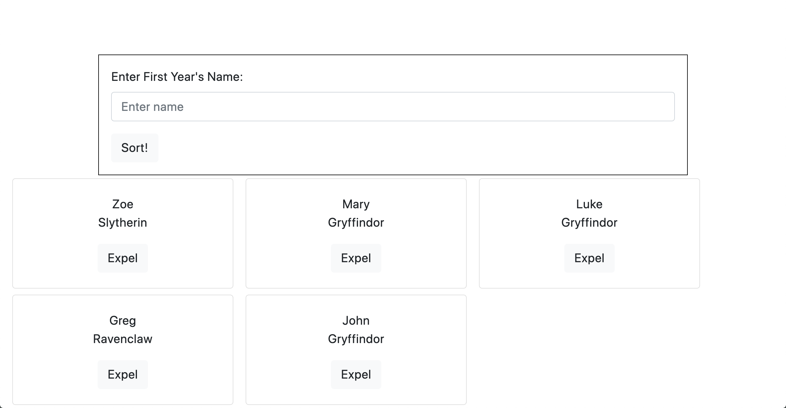

# Sorting Hat Website

## Description
Website used to accept a Hogwarts incoming student name and "sort" the student into one of four houses randomly.  It also allows for students to be expeled at the click of a button.  Explores the uses of arrays and how to minipulate them using functions and print to dom functions.

## Screenshots
Home Page:

After adding students: 

After expelling a student:

## How to Run
1. Clone this repo
1. Make sure you have http-server installed via npm. If not get it [here](https://www.npmjs.com/package/http-server)
1. On your command line, run `hs -p 9999`
1. In your browser, go to `http://localhost:9999`