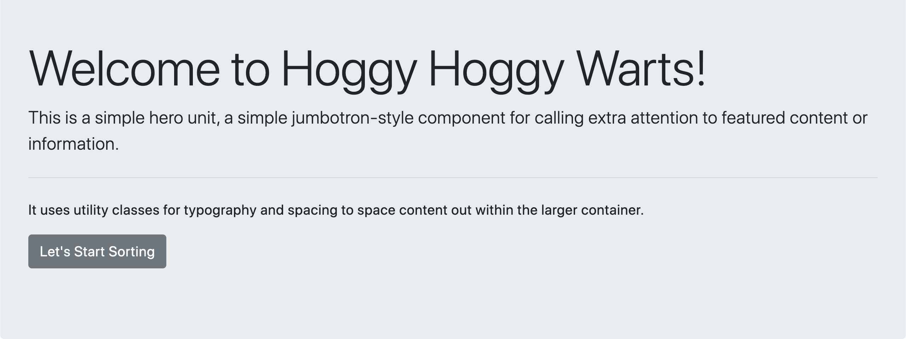
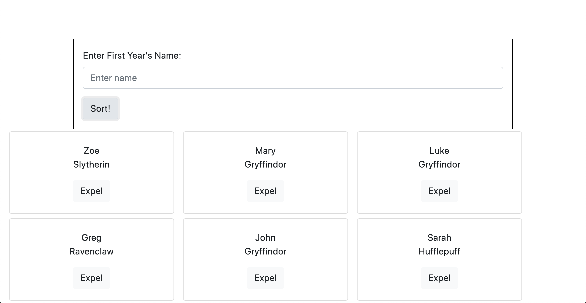

# Sorting Hat Website

## Description
Website used to accept a Hogwarts incoming student name and "sort" the student into one of four houses randomly.  It also allows for students to be expeled at the click of a button.  Explores the uses of arrays and how to minipulate them using functions and print to dom functions.

## Screenshots

